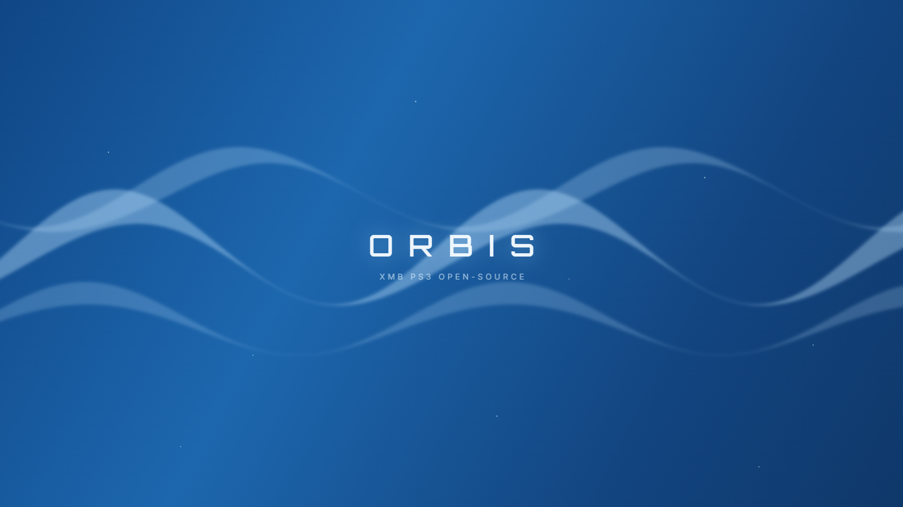
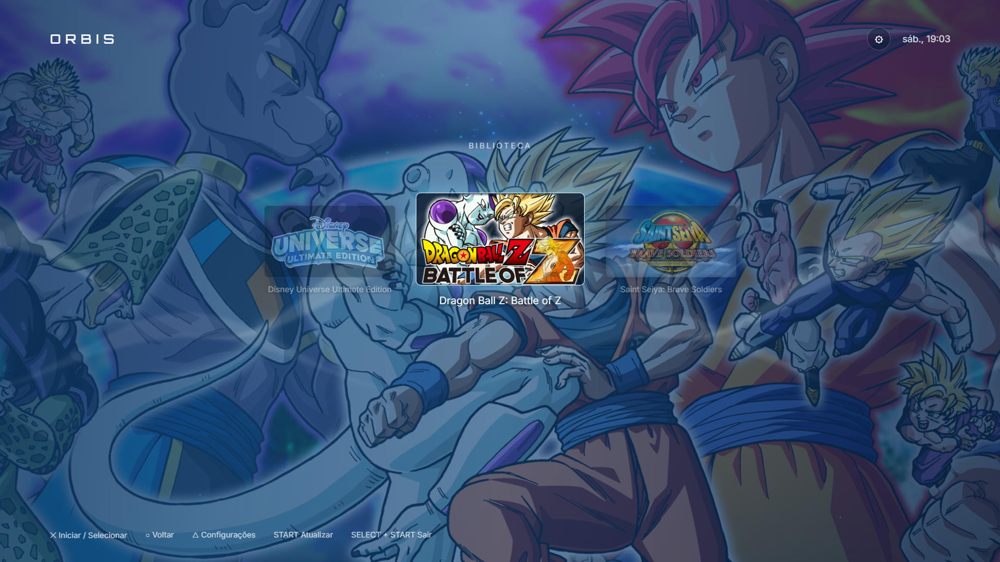
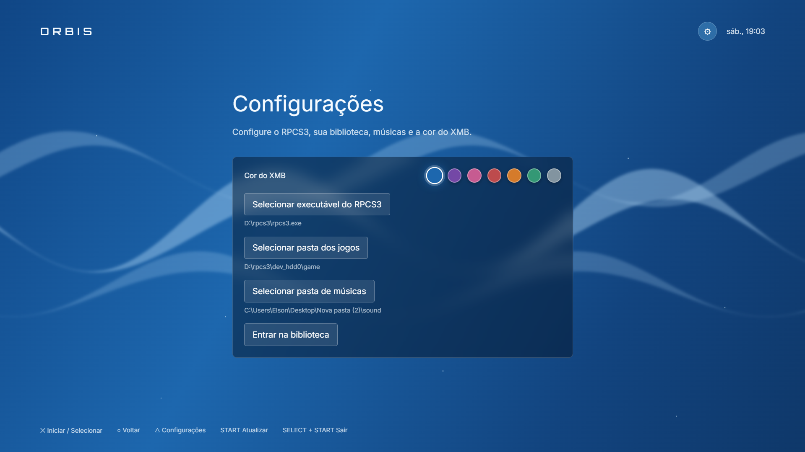
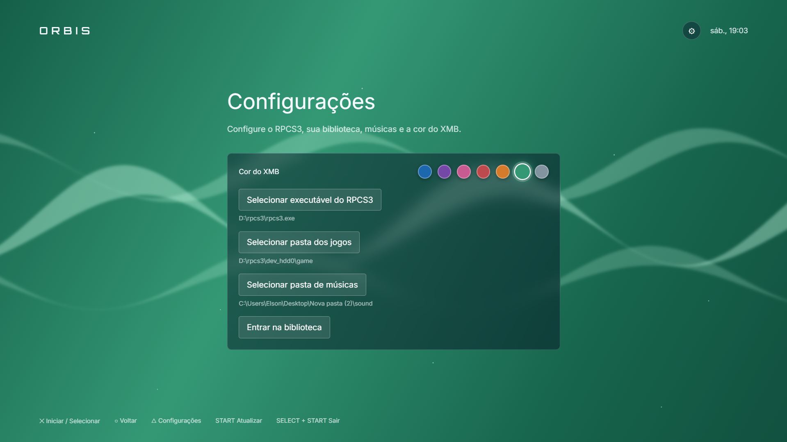

# Orbis XMB

  Uma nova forma de explorar e iniciar sua biblioteca do RPCS3.

  <strong>Biblioteca local • Interface imersiva • Navegação simples</strong>

---

## Sobre o projeto

O **Orbis XMB** é um launcher de jogos para o [RPCS3](https://rpcs3.net/) criado para transformar uma coleção local em uma experiência visual mais agradável, organizada e próxima da navegação de um console.

Em vez de apresentar apenas uma lista de arquivos, o aplicativo reúne capas, planos de fundo e informações dos jogos em uma interface horizontal feita para ser usada em tela cheia. A proposta é oferecer uma central simples para descobrir, selecionar e iniciar os títulos da biblioteca sem substituir o emulador.

> O Orbis XMB é um projeto independente e não possui afiliação com a Sony Interactive Entertainment, PlayStation ou RPCS3.

## Prévia

### Tela principal

  

### Detalhes e navegação

  

### Configurações e cores

  
  

  Personalize a aparência da interface escolhendo a cor que combina com o seu ambiente.

## Principais recursos

- **Biblioteca visual:** reúne os jogos em uma interface horizontal, fluida e focada nas artes de cada título.
- **Descoberta automática:** identifica jogos extraídos, instalações com `EBOOT.BIN` e imagens no formato `.iso`.
- **Metadados do próprio jogo:** lê título e identificador diretamente do arquivo `PARAM.SFO`.
- **Capas e planos de fundo:** aproveita arquivos como `ICON0.PNG`, `PIC0.PNG` e `PIC1.PNG` quando disponíveis.
- **Inicialização integrada:** abre o título selecionado diretamente no RPCS3, em tela cheia.
- **Instalação de PKG e RAP:** permite instalar pacotes e licenças no RPCS3 sem abrir a interface do emulador.
- **Gestão por jogo:** oferece atalho para abrir a pasta do título e remover instalações do `dev_hdd0`.
- **Descoberta ampliada:** localiza jogos na pasta escolhida e também no `dev_hdd0` configurado no RPCS3.
- **Música personalizada:** permite transformar uma pasta local de músicas na trilha sonora da interface.
- **Diferentes formas de navegação:** oferece suporte a teclado, mouse e controles compatíveis no Linux.
- **Experiência em tela cheia:** pensado para computadores conectados à TV, handhelds e setups dedicados à emulação.

## Instalação de PKG e RAP

O Orbis XMB pode instalar conteúdo diretamente no RPCS3 a partir da própria interface:

1. use o ícone de instalação no cabeçalho;
2. selecione um ou mais arquivos `.pkg`, `.rap` ou `.edat`;
3. confirme a ordem da fila e inicie a instalação;
4. o RPCS3 recebe o conteúdo em modo headless, sem abrir a janela do emulador;
5. ao fechar o instalador, a biblioteca é atualizada para exibir o jogo instalado.

Também é possível atualizar a biblioteca manualmente pelo ícone de refresh no cabeçalho.

No menu de cada jogo, o usuário pode:

- abrir a pasta do título;
- remover jogos instalados no `dev_hdd0` do RPCS3, com confirmação.

> A instalação headless exige uma versão do RPCS3 de **30/05/2026** ou posterior. Utilize apenas conteúdo obtido de forma legal.

## Como funciona

O Orbis XMB atua como uma camada visual entre o usuário e o RPCS3:

1. examina a pasta de jogos escolhida e o `dev_hdd0` configurado no emulador;
2. identifica jogos e coleta os metadados disponíveis;
3. organiza os títulos e suas artes na interface;
4. solicita ao RPCS3 que inicie o jogo selecionado ou instale pacotes e licenças quando pedido.

O aplicativo não inclui o RPCS3, firmware, jogos ou arquivos protegidos por direitos autorais.

## Privacidade e conteúdo local

Toda a biblioteca permanece no computador do usuário. O Orbis XMB indexa nomes, caminhos, metadados e imagens já existentes nas pastas selecionadas.

O projeto:

- não baixa nem distribui jogos;
- não envia informações da coleção para serviços externos;
- solicita ao RPCS3 a instalação de PKG, RAP e EDAT quando o usuário escolhe essa ação;
- remove do `dev_hdd0` apenas jogos instalados quando o usuário confirma a exclusão;
- não substitui os requisitos de instalação e configuração do RPCS3.

## Tecnologias

O projeto é uma aplicação desktop construída com:

- **Electron**
- **Node.js**
- **HTML, CSS e JavaScript**
- **electron-builder** para distribuição em AppImage

O foco inicial do projeto é o **Linux**, com empacotamento em AppImage.

## Estado do projeto

O Orbis XMB está em desenvolvimento e aberto à comunidade. Ideias, relatos de problemas e contribuições são bem-vindos para melhorar compatibilidade, experiência de navegação e suporte a diferentes ambientes.

## Licença

Distribuído sob a licença **MIT**. Consulte o arquivo [`LICENSE`](LICENSE) para mais detalhes.

## Aviso legal

Este software é apenas uma interface independente para organizar e iniciar conteúdo local por meio do RPCS3. **PlayStation** é uma marca registrada da Sony Interactive Entertainment. **RPCS3** pertence aos seus respectivos desenvolvedores.

Utilize somente jogos, firmware e outros conteúdos obtidos de forma legal. Nenhum conteúdo protegido acompanha este projeto.

